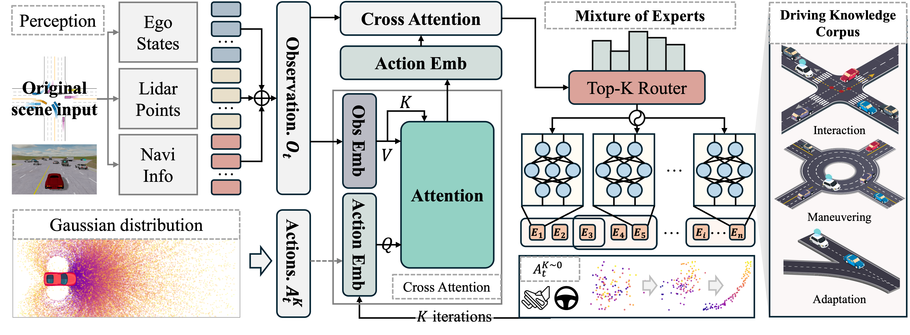

# 🚘 KDP-AD  

<div align="center">

### A Knowledge-Driven Diffusion Policy for End-to-End Autonomous Driving Based on Expert Routing

[](https://perfectxu88.github.io/KDP-AD/) [](https://perfectxu88.github.io/KDP-AD/) [](https://opensource.org/licenses/Apache-2.0)

[**📄 Paper**](https://arxiv.org/abs/todo.todo) | [**🌐 Project Page**](https://perfectxu88.github.io/KDP-AD/)

</div>


---

## 📌 Framework

<div align="center">

</div>

---

## ✨ Highlights

- **Generative Policy Learning**  
  Driving modeled as conditional denoising of trajectories → captures **multi-modal behaviors** & **long-horizon consistency**.
- **Knowledge-Driven Expert Routing**  
  Sparse MoE experts encode modular driving knowledge → dynamically compose experts per scenario for **adaptive policy execution**.
- **Scalable & Interpretable**  
  Experts exhibit **structured specialization** and **cross-scenario reuse**.

---

## 🎥 Demo Video  

https://github.com/user-attachments/assets/d71d7a71-549f-40a3-b2ad-084ebd82e6e3

---

## ✅ Roadmap

- [ ] 📝 **Release Paper**  
- [ ] 💻 **Release Code**  
- [ ] 🔧 **Release Model Checkpoints** 

---

## 🛠️ Getting Started

### 🔹 Installation

```bash
# Clone the repository
git clone https://github.com/PerfectXu88/KDP-AD.git
cd KDP-AD
conda create -n kdp python=3.10
conda activate kdp
# Install dependencies
pip install -r requirements.txt
```

### 🔹 Data Collection

```bash
python data_collect.py
```

### 🔹 Training

```bash
python train.py
```

### 🔹 Inference

```bash
python eval.py
```

---

## 🙌 Acknowledgements  

This work builds upon the foundation of the following outstanding contributions to the open-source community:  

[MetaDrive](https://github.com/metadriverse/metadrive), [Diffusion](https://github.com/hojonathanho/diffusion), [Diffusion Policy](https://github.com/real-stanford/diffusion_policy), [Mixture of Experts](https://github.com/davidmrau/mixture-of-experts), [Mixture of Expert(Pytorch)](https://github.com/lucidrains/mixture-of-experts)

We thank the open-source community for providing code, benchmarks, and datasets that made this project possible.  

---

## 📚 Citation  

If you find **KDP-AD** useful in your research, please cite our work:  

```bibtex
@article{xu2025kdp,
  title   = {A Knowledge-Driven Diffusion Policy for End-to-End Autonomous Driving Based on Expert Routing},
  author  = {Xu, Chengkai and Liu, Jiaqi and Guo, Yicheng and Hang, Peng and Sun, Jian},
  journal = {arXiv preprint arXiv:todo,todo},
  year    = {2025}
}
```